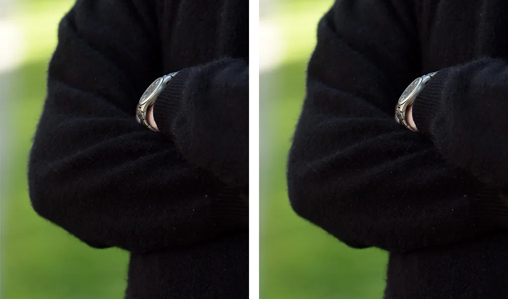

# TASK 4 - 2D matrix slicing

## 1. Problem

The task is to implement 2D matrix slicing with NumPy and a C-like language (Java), and to show the results on an image, so it is possible to see if both solutions give the same result.

## 2. Environment

- macOS, Apple M5 
- Python 3.14.7, NumPy 2.5.3, Pillow 12.3.0
- OpenJDK 27
- Input image: `code/input.png`, 1600 rows x 1075 columns

## 3. Design decisions

**An image is a matrix.** Each pixel is one element with 3 color values (red, green, blue). So slicing an image is the same as slicing a 2D matrix, and the result is easy to check by looking at it.

**NumPy slice syntax from user input.** The user enters the image path, a row slice and a column slice in NumPy's `start:stop:step` form, for example `400:1200`, `::-1` or `-600:`. Nothing is hard-coded. Invalid input (text, step 0, a missing `:`) and empty results are rejected.

**A `Slice` class in Java with the same rules as NumPy.** Java has no slicing, so `Slice` turns the text into a list of indices. It follows Python's `slice.indices()` rules: empty parts use defaults, negative numbers count from the end, values outside the image are limited to it, `stop` is not included, and a negative step walks backwards. The results in section 5, including `::-1` and `-600:`, show that it gives exactly the same output as NumPy.

**One flat array in Java.** `getRGB` gives all pixels in one `int[]`, row after row, so pixel `(r, c)` is at `r * cols + c`, the same row-major layout as in Task 3.

**PNG output.** PNG is lossless, so every pixel is saved exactly. JPG would change pixels slightly and break the pixel-by-pixel comparison.

**Automatic comparison.** `compare.py` checks that both images have the same size, counts the different pixels, and saves both images side by side with a white gap between them.

## 4. Implementation

NumPy, the slicing itself:

```python
result = image[rows, cols]
```

Java, after `Slice` has computed `rowIndices` and `colIndices`:

```java
for (int r = 0; r < outRows; r++) {
    int sourceRow = rowIndices[r] * cols;
    for (int c = 0; c < outCols; c++) {
        result[r * outCols + c] = pixels[sourceRow + colIndices[c]];
    }
}
```

## 5. Results

Each case was run with both programs, and the outputs were compared with `compare.py`.

| Row slice | Column slice | Effect | Result size | Different pixels |
|---|---|---|---|---|
| `::` | `::` | full image | 1600 x 1075 | 0 of 1,720,000 |
| `400:1200` | `200:900` | crop of the middle | 800 x 700 | 0 of 560,000 |
| `::-1` | `::` | upside down | 1600 x 1075 | 0 of 1,720,000 |
| `::2` | `::-1` | every 2nd row, mirrored | 800 x 1075 | 0 of 860,000 |
| `-600:` | `:500` | bottom-left corner | 600 x 500 | 0 of 300,000 |

NumPy on the left, Java on the right:

**Crop** (`400:1200`, `200:900`)


**Upside down** (`::-1`, `::`)


**Every 2nd row, mirrored** (`::2`, `::-1`)


**Bottom-left corner** (`-600:`, `:500`)



In all cases both results are exactly the same: the sizes match and 0 pixels are different. The images alone could hide a small mistake, like one extra row, so the pixel count is the stronger proof.

Error handling is the same in both versions: `5` (no `:`), `1:2:0` (step 0) and a wrong file name are rejected, and `1200:400` gives an empty slice.

## 6. Analysis

**View vs copy.** The lecture slides say that a slice is "nothing more than a referencing mechanism". This is how NumPy works: `image[rows, cols]` does not copy the pixels. It returns a view, which only stores a new start position, shape and strides (step sizes in memory) over the same data. Even `::-1` is just a negative stride. So slicing in NumPy is very fast and uses almost no extra memory, but changing the slice also changes the original image.

I checked this with a small test:

```python
a = np.arange(10)
s = a[::2]
s[0] = 99
print(a[0], np.shares_memory(a, s))   # 99 True
```

Changing the slice changed the original array, and `np.shares_memory` confirms they use the same memory.

This matches the NumPy documentation: "NumPy slicing creates a view instead of a copy as in the case of built-in Python sequences such as string, tuple and list."

My Java version copies the selected pixels into a new array. This costs extra memory and time, but the result is independent from the original. To make a view in Java, I would need a class that keeps a reference to the original array plus the start and step for each dimension.

**Effort.** In NumPy the slicing is one line, because the rules are built into the language. In Java I had to write the rules myself in the `Slice` class. This was the hardest part, because cases like `::-1` or `-600:` must behave exactly like NumPy.

**Code size** (`wc -l`): `slice_numpy.py` 54, `Slice.java` 67, `SliceImage.java` 80, `compare.py` 32.

## 7. ChatGPT comparison

Full session: [chatgpt.md](chatgpt.md). Its code: [chatgpt/prompt1/](chatgpt/prompt1/) and [chatgpt/prompt2/](chatgpt/prompt2/), copied without changes.

### How it solved the problem

With the original task, ChatGPT used a small integer matrix typed by the user and drew the sliced numbers as a grayscale grid image. It supported only `start:end` slices, without step or negative indices. It said the NumPy and Java images "should be pixel-for-pixel identical", but did not check it.

I ran both programs with the same 5 x 5 matrix and compared the images with my `compare.py`: **70000 of 90000 pixels were different**. The Java image was darker, because writing with `setRGB` into a `TYPE_BYTE_GRAY` image changes the gray values.

### How I led it to the required result

1. **Prompt 1:** the original task.
2. **Prompt 2:** asked for the full NumPy slicing rules from user input, told it the result of my pixel comparison and asked why, asked if the Java code is efficient, and asked for an automatic proof.

After prompt 2 it found the real reason for the bug, fixed it, implemented the full slicing rules, switched to a flat row-major array and added a comparison of both the numbers and the images. With the same 5 x 5 matrix, both a normal slice (`1:4`, `1:4`) and a hard slice (`::-1`, `-4:-1:2`) gave 0 different pixels.

### Comparison

| | Mine | ChatGPT (after prompt 2) |
|---|---|---|
| Input data | a real photo | a small matrix typed by the user |
| Slicing rules | full NumPy rules | full NumPy rules |
| Java data structure | flat row-major `int[]` | flat row-major `long[]` |
| Java code size | 147 lines | about 500 lines |
| Proof | pixel comparison | comparison of numbers and pixels |

ChatGPT's first answer looked correct but its images were not the same, and it claimed they were without checking. It only found the bug after I showed it the pixel count. Its final version is correct but much longer than mine. Its idea to compare the numbers too is good, because it checks the slicing directly.

## 8. Critique and limitations

- **Java copies, NumPy does not.** My Java slice uses extra memory for every result, while NumPy's view does not.
- **Input format.** Comparing JPG inputs could fail even with correct slicing, because Pillow and Java may decode JPG slightly differently. PNG input avoids this.
- **Only RGB.** Transparency (alpha) is removed in both versions.
- **Very large numbers.** In Java, slice values bigger than the `int` range are rejected as "not an integer", while Python accepts any integer.

## 9. How to run

From `task4/code`, with the virtual environment active (see Task 3):

```bash
pip install -r requirements.txt
python slice_numpy.py
java SliceImage.java
python compare.py
```

Java 22 or newer is required.

## References

- Lecture slides, Basics of Programming Languages, CSCI 6221: Slices ("a slice is some substructure of an array; nothing more than a referencing mechanism")
- [NumPy documentation: Indexing on ndarrays (basic slicing returns views)](https://numpy.org/doc/stable/user/basics.indexing.html)
- [Python documentation: slice.indices](https://docs.python.org/3/reference/datamodel.html#slice.indices)